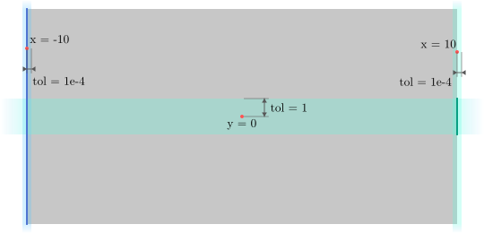

# Parameter Configuration Guide

This guide details how to configure simulations using the `.prm` file format. The solver uses the `deal.II` ParameterHandler.

To run a simulation with a specific configuration stored in a subfolder:

```bash
mpirun -np 8 ../build/topopt your_parameters.prm
```

The command `-np 8` controls number of processors, which should be adjusted according to the used hardware.

## Quick Start Example

Below is a standard configuration for a compliance minimization problem with stress constraints using Variable-Thickness design and MMA optimizer.

```properties
# --------------------------------------------------
# General & Output
# --------------------------------------------------
set Analysis name    = crack-compliance-min
set BVP Type         = elasticityLin
set Destination path = ./results/crack-compliance-min/
set Problem type     = opt             # Options: opt, std
set Verbose output   = false

# --------------------------------------------------
# Domain & Geometry
# --------------------------------------------------
subsection Domain
  set Geometry name = hyper_rectangle
  set Global refinements = 1
  set Padding = true
  
  subsection Hyper rectangle
    set Hyper rectangle point1 = -10,-10
    set Hyper rectangle point2 = 0,10
    set Hyper rectangle subdivisions = 20,40
  end

  subsection Boundary
    # Multiple boundaries for complex loading/constraint setup
    set Boundary IDs   = 1,1,2,2,3,3
    set Boundary comp  = 0,1,0,1,0,1
    set Boundary coord = 0,-5,-10,9.5,-0.25,-10
    set Boundary tol   = 1e-4,5,1e-4,0.5,0.25,1e-4
  end
end

# --------------------------------------------------
# Boundary Value Problem (Physics)
# --------------------------------------------------
subsection BVP
  set Polynomial degree = 1

  subsection Dirichlet BC
    # Fix boundaries ID 1 (x-direction) and ID 3 (y-direction)
    set Dirichlet ID    = 1,3
    set Dirichlet comp  = 0,1
    set Dirichlet value = 0,0
  end

  subsection Neumann BC
    # Load boundary ID 2 in x-direction with -0.01
    set Neumann ID    = 2
    set Neumann comp  = 0
    set Neumann value = -0.01
  end
end

# --------------------------------------------------
# Material
# --------------------------------------------------
subsection Material
  set Material law = NeoHooke

  subsection Elastic isotropic
    set lambda       = 0.3297 # Plane stress
    set mu           = 0.3846
  end
end

# --------------------------------------------------
# Solver
# --------------------------------------------------
subsection Solver
  set Solver tolerance = 1e-8
  set Solver type      = Direct
end

# --------------------------------------------------
# Optimization Settings
# --------------------------------------------------
subsection Optimization
  set Optimizer = MMA
  set Continuation interval = 1
  set Continuation start iteration = 1
  
  subsection MMA
    set Asymptote move decrease = 0.7
    set Asymptote move increase = 1.2
    set Asymptote move initial  = 0.5
    set Constraint modification = true
    set Move limit              = 0.02
    set Robust asymptotes type  = 0
  end 

  subsection Responses
    set Objective           = compliance
    set Constraints         = volume, PNStress
    set Constraints types   = upper, upper
    set Constraints values  = 0.3, 0.02
  end

  subsection Design field
    set Mode = variable-thickness
    set Initial density       = 0.8
    set Penalty               = 3
    set Stress relaxation epsilon initial = 0.1
    set Stress relaxation epsilon target = 0.001
    set Stress relaxation target iteration = 150

    subsection Variable-thickness
      set Penalty continuation = false
      set Penalty target iteration = 50
      set Low thickness threshold = 0.1
    end
  end

  subsection Filters
    set Blur filter = true
    set Blur filter type = pde
    set Blur filter radius = 0.25
    set PDE filter boundary penalization = false

    set Heaviside projection = true
    set Heaviside projection threshold = 0.5
    set Heaviside projection beta = 10
    set Heaviside projection target iteration = 100

    subsection Variable-thickness
      set DGI projection = true
      set DGI projection beta = 10
      set DGI projection target iteration = 100
    end
  end

  subsection Convergence
    set Design change tolerance           = 0.0001
    set Max iterations                    = 300
  end

  subsection Adaptive meshing
    set Active = true
    set Start iteration = 5
    set Adaptation interval = 5
    set Criterion = DENSITY-JUMP
    set Max h refinements = 2
    set Min h refinements = 0
    set Relative threshold refinement = 0.05
    set Relative threshold coarsening = 1e-2
  end
end
```

-----

## Parameter Reference

### 1\. General Settings

Global settings for file I/O and problem definition.

| Parameter | Type | Default | Description |
| :--- | :--- | :--- | :--- |
| `Analysis name` | String | `topopt` | Prefix for output files. |
| `Destination path` | Path | `./results/` | Output directory. |
| `Problem type` | String | `opt` | `opt` (Optimization) or `std` (Standard BVP). |
| `BVP Type` | String | `elasticityLin` | `elasticityLin` |
| `Verbose output` | Bool | `false` | Enable detailed debug output. |

### 2\. Domain (Geometry)

Configures the mesh and boundary identification for applying boundary conditions.

**Top Level Options:**

Possible input geometries are given by the following option:

  * `Geometry name`: `hyper_rectangle` (default), `hyper_L` or `abaqus`.

#### Subsection: Abaqus

Abaqus mesh is supported as an .inp file:

| Parameter | Default | Description |
| :--- | :--- | :--- |
| `Input file` | `./abq.inp` | Path to `.inp` file. |
| `Abaqus refinements` | `0` | Global refinements after import. |

#### Subsection: Hyper rectangle

Standard rectangular domain:

| Parameter | Format | Description |
| :--- | :--- | :--- |
| `Hyper rectangle point1` | `x,y,z` | Bottom-left corner coordinates. |
| `Hyper rectangle point2` | `x,y,z` | Top-right corner coordinates. |
| `Hyper rectangle subdivisions` | `nx,ny,nz` | Number of elements per direction. |
| `Hyper rectangle refinements` | `Integer` | Number of global refinements. |

#### Subsection: Hyper L

L-shaped domain, useful for stress-constrained problems:

| Parameter | Description |
| :--- | :--- |
| `Hyper L point1` | Bottom-left corner. |
| `Hyper L point2` | Top-right corner. |
| `Hyper L subdivisions` | Elements per direction. |
| `Hyper L cells to remove` | Cells to cut from upper right corner (`nx,ny,nz`). |
| `Hyper L refinements` | Global refinements. |

#### Subsection: Boundary

Here we instruct the program how to find and assign IDs to the specific parts of the boundary that we later assign Dirichlet or Neumann DC (in the following subsections).

  * **Note:** All lists must be of equal length.
  * `Boundary IDs`: List of integer IDs to assign.
  * `Boundary comp`: Component axis to check (0=x, 1=y).
  * `Boundary coord`: Coordinate value on the specified axis.
  * `Boundary tol`: Tolerance for coordinate detection.



-----

### 3\. BVP (Boundary Value Problem)

Physics and Finite Element settings.

  * `Polynomial degree`: FE order (1, 2, or 3).

#### Dirichlet & Neumann BC

Lists must correspond to IDs defined in the **Domain \> Boundary** section.

| Parameter | Type | Description |
| :--- | :--- | :--- |
| `Dirichlet ID` / `Neumann ID` | List (Int) | Boundary IDs to apply BC to. |
| `Dirichlet comp` / `Neumann comp` | List (Int) | DoF component (0=x, 1=y). |
| `Dirichlet value` / `Neumann value` | List (Double) | Displacement or Load magnitude. |

Each entry in the list corresponds to just one component (one degree of freedom per node). For example, to fix the displacement in both x and y directions, one needs to input the Dirichlet ID twice and the corresponding components as 0 and 1, respectively. 

-----

### 4\. Material

  * `Material law`: `NeoHooke` (default).
  
  AD - the model utilizes Automatic Differentiation to calculate stresses and the tangent matrix.

#### Elastic isotropic

| Parameter | Default | Description |
| :--- | :--- | :--- |
| `lambda` | `0.5769` | Lamé's first parameter. |
| `mu` | `0.3846` | Shear modulus (G). |

The default values correspond to the Young's modulus of 1 and Poisson's ratio of 0.3.

-----

### 5\. Solver

Linear algebra solver settings.

  * `Solver type`: `CG` (default), `Direct`.
  * `Solver tolerance`: Iterative solver tolerance (default: `1e-9`).

-----

### 6\. Optimization

Configuration for the topology optimization.

| Parameter | Default | Description |
| :--- | :--- | :--- |
| `Optimizer` | `MMA` | `MMA` |
| `Continuation interval` | `1` | Interval (in iterations) for applying parameter continuation updates |
| `Continuation start iteration` | `1` | Iteration at which parameter continuation begins |
| `Gradient L2 normalization` | `false` | L2 normalization - can be tried in case the optimizer struggles with convergence |
| `Non-design boundary IDs` | List | Boundary IDs where density is fixed to 1. |
| `Non-design boundary thickness` | List | Thickness (measured as the normal distance from the boundary) for the non-design regions. |

#### MMA

MMA (Method of Moving Asymptotes - Svanberg (1987)) essential options are available to fine tune the optimizer:

* `Move limit`: `0.1` (default).
* `Asymptote move initial`: `0.1` (default).
* `Asymptote move decrease`: `0.7` (default).
* `Asymptote move increase`: `1.2` (default).
* `Robust asymptotes type`: `0` (default); options: `0` or `1`.

#### Design field

  * `Mode`: `variable-thickness`.
  * `Initial density`: Start value for densities (default: `0.5`).
  * `Penalty`: Intermediate density penalization exponent (default: `3.0`).
  * `Stress relaxation epsilon initial`: Initial value for stress exponent interpolation (default: `0.1`).
  * `Stress relaxation epsilon target`: Target value for stress exponent interpolation (default: `0.01`).
  * `Stress relaxation target iteration`: Iteration at which stress exponent reaches target value (default: `100`).
  
#### Subsection: Variable-thickness

* `Penalty continuation`: Enable penalty continuation (default: `false`).
* `Penalty target iteration`: Iteration at which penalty reaches target value (default: `50`).
* `Low thickness threshold`: Thin features below this density value will be eliminated. Default: `0.1`.

#### Filters

  * `Blur filter`: (Bool) Enable density filtering.
  * `Blur filter type`: `PDE` (default) or `radius`.
  * `Blur filter radius`: Filter radius value.
  * `PDE filter boundary penalization`: Apply boundary penalization to eliminate boundary "sticking". Default: `false`.
  * `Heaviside projection`: (Bool) Enable projection.
  * `Heaviside projection threshold`: Projection threshold. Default: `0.5`.
  * `Heaviside projection beta`: Projection sharpness (target) (default: `50`). Starting value is `1`.
  * `Heaviside projection target iteration`: Iteration at which Heaviside beta reaches target (default: `100`).
  
#### Subsection: Variable-thickness

* `DGI projection`: Enable density-gradient-informed (DGI) projection. Default: `true`.
* `DGI projection beta`: Projection sharpness (target value). Default: `10`.
* `DGI projection target iteration`: Iteration at which DGI beta reaches target (default: `100`).

#### Adaptive meshing

  * `Active`: (Bool) Enable mesh adaptivity.
  * `Start iteration`: Iteration to begin adapting, default: `5`.
  * `Adaptation interval`: Frequency of adaptation, default: `5`.
  * `Criterion`: options, `DENSITY-JUMP` (default - recommended for general use), `DENSITY`, `CNF` (only nonlinear BVP), `VONMISES`
  * `Max h refinements`: Max refinement level allowed, default: `3`.
  * `Min h refinements`: Min refinement level allowed, default: `0`.
  * `Relative threshold refinement`: Relative threshold is a multiplier for maximum computed value of a chosen criterion, above which cells are market for refinement. Default: `0.25`.
  * `Relative threshold coarsening`: Relative threshold is a multiplier for maximum computed value of a chosen criterion, below which cells are market for coarsening. Default: `0.01`.

**NOTE:** the refinement levels are counted starting from the base mesh, i.e. the **subdivisions** setting from the **Domain** section. Note that the actual starting refinement level is determined by **Global refinements** setting in the **Domain** section. Using both **subdivisions** and **Global refinements** settings is essential to determine the coarsest possible level for mesh adaptivity.

#### Responses

Define the Objective and Constraints.

| Parameter | Description |
| :--- | :--- |
| `Objective` | Single response name (e.g., `compliance`). |
| `Constraints` | **List** of response names (e.g., `volume`). |
| `Constraints types` | List: `upper`, `lower`, `equality`. |
| `Constraints values` | List of numerical bounds. |

**Available Responses:** `compliance`, `volume`, `PNStress`.

#### Convergence

  * `Max iterations`: Maximum optimization steps.
  * `Design change tolerance`: Stopping criterion (default: `0.001`). Computed as the mean density change over the domain.

<!-- end list -->